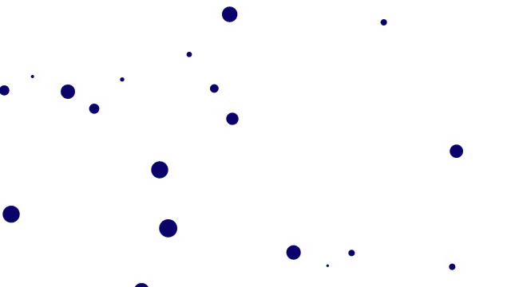

# wasm-dom-cpp

Inspired by my previous C/DOM interaction project, [wasm-canvas](https://github.com/alextyner/wasm-canvas), and the Java/DOM interface included with the [TeaVM](https://github.com/konsoletyper/teavm/tree/master/jso/apis/src/main/java/org/teavm/jso) project, this library aims to make proof-of-concept rendering and simple visualization highly accessible to a lower level language like C++.

This project provides a layer of abstraction for manipulating elements of the HTML DOM -- with a focus on the canvas element in particular -- from C++ compiled with [Emscripten](https://emscripten.org/).



**[test/physics/main.cpp](test/physics/main.cpp)**

## Goals

Ultimately, I'd like this C++ library to be as feature-complete as the one provided with TeaVM for Java. While possible, such a task would require a more involved approach on the C++ side to make up for the lack of elegant compiler [trickery](http://teavm.org/javadoc/0.5.x/jso/core/org/teavm/jso/JSBody.html) used for the Java implementation.

## Usage

### Headers

This is a header-only library. All headers can be found in the `include/` directory.

You can include `wasm-dom.hpp` for all available functionality,

```c++
#include "wasm-dom.hpp"
```

or include individual headers.

```c++
#include "wasm-dom/HTMLCanvasElement.hpp"
```

### Compiling

Compile your source code with Emscripten.

```bash
$ em++ -Wall main.cpp -o index.html
```

For more involved compilation examples, see the Makefiles for the projects linked below. They can be found within the `test/` directory.

## Examples

[Canvas Rendering Function Tests](https://alextyner.github.io/wasm-dom-cpp/ex-features/)

[Basic Physics Simulation](https://alextyner.github.io/wasm-dom-cpp/ex-physics/) (warning: flashing visuals)
